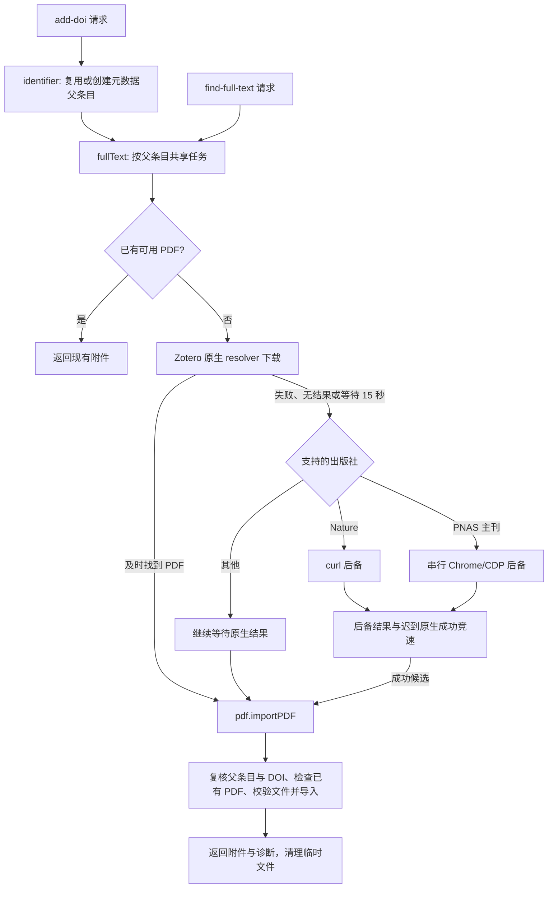

# 项目结构与 PDF 下载流程

`doi2pdf` 为 Zotero 本地 API 扩展标识符导入、DOI 元数据导入和 PDF 获取功能。
运行时代码在 Zotero 的 Gecko 环境内执行；Node.js 用于构建及本地模拟测试。

## 目录职责

| 路径                      | 职责                                                      |
| ------------------------- | --------------------------------------------------------- |
| `addon/`                  | 插件 bootstrap、manifest、偏好设置、界面和语言资源        |
| `src/index.ts`            | 初始化插件实例                                            |
| `src/addon.ts`            | 注册/注销端点，保留通用标识符导入、健康检查和集合查询接口 |
| `src/hooks.ts`            | 启动、窗口及关闭事件；关闭时取消 PNAS 下载                |
| `src/endpoints/`          | DOI 导入、全文查询、本地 PDF 导入的 HTTP 参数校验和响应   |
| `src/services/`           | 元数据、全文协调、下载传输及附件持久化                    |
| `src/utils/`              | 偏好设置、本地化、窗口及 toolkit 工具                     |
| `test/`                   | PDF 模拟单元测试，以及需要 Zotero 的启动/标识符测试       |
| `doc/`                    | Nature 与 PNAS 下载验证记录                               |
| `typings/`                | 插件全局对象、偏好设置和国际化类型                        |
| `zotero-plugin.config.ts` | 编译、资源打包和 XPI 构建设置                             |

## PDF 模块职责

| 模块               | 负责的行为                                                                        |
| ------------------ | --------------------------------------------------------------------------------- |
| `identifier.ts`    | DOI 归一化、集合解析、元数据导入与同 DOI 导入去重                                 |
| `fullText.ts`      | 复用已有 PDF、同父条目任务去重、原生下载与出版社后备竞速、结果诊断                |
| `naturePDF.ts`     | curl 下载 Nature 文章和 PDF；校验文章 DOI、域名及 PDF 链接                        |
| `pnasPDF.ts`       | PNAS 主刊页面验证与下载事件匹配；共享 Chrome profile 的队列和关闭取消             |
| `chromeSession.ts` | Chrome 定位与启动、专用 profile、loopback 调试地址校验、CDP 请求及浏览器关闭      |
| `downloadTask.ts`  | 出版社后备的 20 秒总预算、取消通知、超时竞速与迟到候选文件清理                    |
| `subprocess.ts`    | Gecko 子进程接口类型、管道读尽与诊断输出收集                                      |
| `pdf.ts`           | PDF 候选类型、任务临时目录、`stagePDF` 文件所有权、PDF 头校验、附件查询和串行导入 |

Nature 使用 curl，PNAS 使用 Chrome/CDP，各自保留出版社规则。
公共模块复用任务管理、临时文件和附件导入能力；浏览器模块不承担出版社 DOI 或下载 URL 判定。

## DOI 导入与全文获取

- DOI 元数据导入禁用翻译器附件保存，PDF 获取在父条目确定后开始。
- 原生下载没有独立的 15 秒硬超时；15 秒是启动支持的出版社后备的等待阈值。
  原生提前失败或无结果时立即启动后备，迟到的原生成功仍可在后备结束前获胜。
- 出版社后备的 20 秒预算从任务创建时开始，包含 PNAS 排队、程序定位、启动和下载。
- 三条下载路径仅生成临时候选。`stagePDF` 在无结果或异常时清理目录，
  成功时将清理责任交给调用方；下载进程/浏览器先由路线释放。
- `fullText` 完成后清理两条路径的候选，包括迟到结果；`DownloadTask` 额外清理取消后的后备候选。
- `importPDF` 按 `libraryID/itemKey` 串行写入，并复核父条目及预期 DOI。
  自动下载和手动导入共用此入口，避免同一父条目重复导入 PDF。
- PNAS 的共享 profile 必须串行使用，任务目录独立；关闭只操作该任务启动的 Chrome，保留 profile。
- `add-doi` 的显式 `pdfPath` 会在创建元数据前校验，并绕过网络全文查询；
  `import-pdf` 只向现有父条目导入。调用方提供的源文件不会被清理。

## 验证与构建

- `npm run test:unit`：不连接真实 Zotero，模拟原生 resolver、curl、Chrome/CDP 和文件操作。
  覆盖下载竞速、超时、排队/连接取消、DOI/域名/PDF 校验、重复导入保护和临时文件清理。
- `npx tsc --noEmit`：TypeScript 类型检查。
- `npm run lint:check`：Prettier 与 ESLint；可对修改文件单独检查，避免用户本地索引文件影响结果。
- `npm run build`：生成 `.scaffold/build/doi2pdf-v<版本>.xpi` 并检查类型；不会安装插件。
- `npm test`：scaffold 的 Zotero 环境测试，需要实际运行环境。

本地模拟回归不能证明出版社当前可访问、浏览器验证一定通过或特定 Zotero 版本的真实下载行为。
